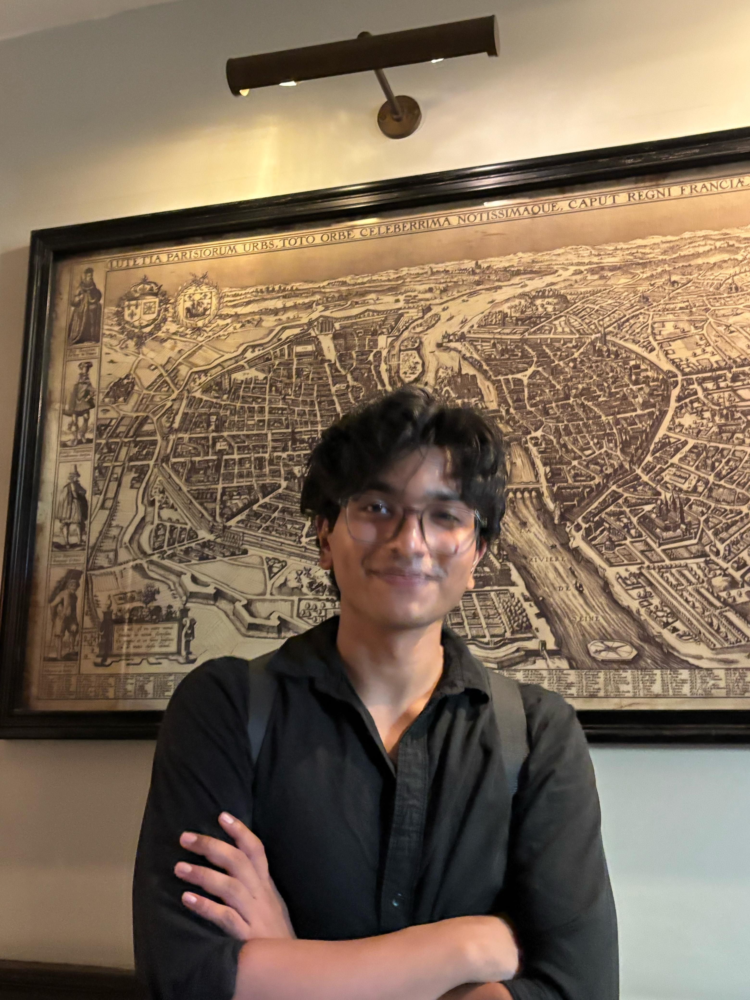

# Master Code

## index.html
```html
<!DOCTYPE html>
<html lang="en">
<head>
  <meta charset="UTF-8" />
  <meta name="viewport" content="width=device-width, initial-scale=1" />
  <meta name="description" content="Deepu James — AI/ML Engineer & Full Stack Developer. B.Tech CSE (AI & DS) at BML Munjal University. Building LLM pipelines, computer vision systems, and full-stack web apps." />
  <title>Deepu James | Portfolio</title>
  <link rel="stylesheet" href="https://cdnjs.cloudflare.com/ajax/libs/font-awesome/6.4.0/css/all.min.css" />
  <link href="https://fonts.googleapis.com/css2?family=Anton&family=Inter:wght@300;400;600;700&family=Manrope:wght=800&display=swap" rel="stylesheet" />
  <link rel="stylesheet" href="style.css" />
</head>
<body>
  <!-- Custom Cursor -->
  <div class="cursor"></div>
  <div class="cursor-follower"></div>

  <div class="noise"></div>

  <main id="smooth-wrapper">
    <div id="smooth-content">
      <div class="hero section" id="home">
        <h1 class="hero-title">DEEPU<br><span class="outline">JAMES</span></h1>
        <p class="hero-subtitle">AI / ML Engineer · Full Stack Developer</p>
        <ul class="contact-list">
          <li><a href="mailto:deepujames089@gmail.com" class="hover-target"><i class="fas fa-envelope"></i></a></li>
          <li><a href="tel:9660031068" class="hover-target"><i class="fas fa-phone"></i></a></li>
          <li><a href="https://github.com/IATESPAGHETTI" target="_blank" class="hover-target"><i class="fab fa-github"></i></a></li>
          <li><a href="https://www.linkedin.com/in/deepu-j-89590723b" target="_blank" class="hover-target"><i class="fab fa-linkedin"></i></a></li>
          <li>
            <a href="resume.pdf" target="_blank" class="hover-target resume-btn">
              <i class="fas fa-file-pdf"></i> Resume
            </a>
          </li>
        </ul>
        <div class="scroll-indicator">
          <span>Scroll</span>
          <div class="line"></div>
        </div>
      </div>

      <div class="container">
        <!-- About -->
        <section class="section" id="about">
          <h2 class="section-title" data-text="About Me">About Me</h2>
          <div class="about-flex">
            <div class="img-wrapper">
                
                <div class="glow"></div>
            </div>
            <div class="about-text">
              <p>
                Final-year B.Tech CSE student specialising in Data Science & AI at BML Munjal University. I build end-to-end ML systems — from fine-tuning LLMs with QLoRA and building RAG pipelines, to deploying real-time computer vision models on-device.
              </p>
              <p>
                Two internships done, multiple research-grade projects shipped, and an entire training stack running locally on an RTX 3060 — zero cloud cost.
              </p>
            </div>
          </div>
        </section>

        <!-- Skills -->
        <section class="section" id="skills">
          <h2 class="section-title" data-text="Skills">Skills</h2>
          <ul class="skills-list">
            <li>Python</li><li>JavaScript</li><li>SQL</li><li>C++</li><li>Java</li><li>Shell</li>
            <li>PyTorch</li><li>TensorFlow</li><li>Hugging Face</li><li>QLoRA</li><li>FAISS</li><li>RAG</li>
            <li>Whisper</li><li>YOLOv8</li><li>ECAPA-TDNN</li><li>OpenCV</li><li>Scikit-learn</li>
            <li>React</li><li>Flask</li><li>FastAPI</li><li>Node.js</li><li>Express</li>
            <li>Docker</li><li>Git</li><li>Linux</li><li>MySQL</li><li>MongoDB</li>
            <li>Arduino</li><li>ESP32</li><li>Raspberry Pi Pico</li>
          </ul>
        </section>

        <!-- Projects -->
        <section class="section" id="projects">
          <h2 class="section-title" data-text="Projects">Projects</h2>
          <div class="project-grid">
            <div class="project-card hover-target">
              <div class="card-bg"></div>
              <div class="card-content">
                  <h3>AgriAdvisor — Agricultural LLM Chatbot</h3>
                  <p>Built an end-to-end LLM chatbot with QLoRA PEFT fine-tuning and FAISS-based retrieval-augmented generation. Evaluated across 7 criteria including hallucination analysis and PEFT efficiency.</p>
                  <div class="tech-stack">
                    <span class="tech">QLoRA</span><span class="tech">FAISS</span><span class="tech">RAG</span><span class="tech">Gradio</span><span class="tech">Hugging Face</span>
                  </div>
                  <a href="https://github.com/IATESPAGHETTI" target="_blank"><i class="fas fa-external-link-alt"></i> View Code</a>
              </div>
            </div>
            <div class="project-card hover-target">
               <div class="card-bg"></div>
               <div class="card-content">
                  <h3>CBAM-YOLOv8n — Cassava Disease Detection</h3>
                  <p>Integrated CBAM attention into YOLOv8n for 3-class disease detection. Outperformed vanilla baseline (mAP50: 0.4823 vs 0.4623). Compressed model from 45MB to 12MB while sustaining 15–30 FPS on-device.</p>
                  <div class="tech-stack">
                    <span class="tech">PyTorch</span><span class="tech">YOLOv8</span><span class="tech">TFLite</span><span class="tech">CBAM Attention</span>
                  </div>
                  <a href="https://github.com/IATESPAGHETTI" target="_blank"><i class="fas fa-external-link-alt"></i> View Code</a>
               </div>
            </div>
            <div class="project-card hover-target">
               <div class="card-bg"></div>
               <div class="card-content">
                  <h3>VoiceMed Assist — AI Clinical Scribe</h3>
                  <p>Bilingual (Hindi–English) speech-to-text pipeline using Whisper for doctor–patient consultations. NLP extraction layer outputs structured Digital Health Records.</p>
                  <div class="tech-stack">
                    <span class="tech">Whisper</span><span class="tech">ECAPA-TDNN</span><span class="tech">Flask</span><span class="tech">Speaker Diarization</span>
                  </div>
                  <a href="https://github.com/IATESPAGHETTI" target="_blank"><i class="fas fa-external-link-alt"></i> View Code</a>
               </div>
            </div>
            <div class="project-card hover-target">
               <div class="card-bg"></div>
               <div class="card-content">
                  <h3>Real-Time Bully Detection Chat</h3>
                  <p>Quantized on-device NLP classifier achieving 92% toxicity detection accuracy and 28ms inference latency. Runs fully without cloud dependency.</p>
                  <div class="tech-stack">
                    <span class="tech">Python</span><span class="tech">TensorFlow Lite</span><span class="tech">NLP</span><span class="tech">Quantization</span>
                  </div>
                  <a href="https://github.com/IATESPAGHETTI/bert_chat" target="_blank"><i class="fas fa-external-link-alt"></i> View Code</a>
               </div>
            </div>
          </div>

          <h3 style="font-family: 'Manrope', sans-serif; font-size: 2.5rem; margin-top: 80px; margin-bottom: 40px; color: var(--text);">Latest from GitHub</h3>
          <div id="github-projects" class="project-grid">
            <!-- GitHub projects injected here via script.js -->
          </div>
        </section>
        <!-- Experience -->
        <section class="section" id="experience">
          <h2 class="section-title" data-text="Experience">Experience</h2>
          <div class="timeline">
            <div class="exp-card">
              <div class="exp-dot"></div>
              <strong>C-DOT, New Delhi — Software Engineering Intern (Jun–Jul 2025)</strong>
              <p>Automated diagnostic log analysis via Bash scripting, cutting manual review time by 70% (10 min to 3 min). Improved embedded error-flag detection pipeline, raising fault-detection accuracy by 35%.</p>
            </div>
            <div class="exp-card">
              <div class="exp-dot"></div>
              <strong>VDocs, Remote — Web Developer Intern (Jun–Jul 2025)</strong>
              <p>Re-architected frontend asset loading pipeline, improving page-load speed by 28%. Integrated REST APIs and raised WCAG accessibility score from 62 to 88.</p>
            </div>
            <div class="exp-card">
              <div class="exp-dot"></div>
              <strong>EV Battery Digital Twin — Platform & UI Lead (2024)</strong>
              <p>Led platform and UI development for a digital twin simulating EV battery swapping networks. Built real-time WebSocket visualization of State-of-Health metrics, targeting 20% downtime reduction.</p>
            </div>
          </div>
        </section>
      </div>

      <footer>
        <h2 class="footer-title">LET'S CONNECT</h2>
        <a href="mailto:deepujames089@gmail.com" class="footer-email hover-target">deepujames089@gmail.com</a>
        <p class="copyright">&copy; 2025 Deepu James</p>
      </footer>
    </div>
  </main>

  <!-- Libraries -->
  <script src="https://cdnjs.cloudflare.com/ajax/libs/gsap/3.12.2/gsap.min.js"></script>
  <script src="https://cdnjs.cloudflare.com/ajax/libs/gsap/3.12.2/ScrollTrigger.min.js"></script>
  <script src="https://cdn.jsdelivr.net/gh/studio-freight/lenis@1.0.29/bundled/lenis.min.js"></script>
  <script src="script.js"></script>
</body>
</html>

```

## style.css
```css
:root {
  --bg: #050505;
  --text: #f0f0f0;
  --accent: #ff3366;
  --accent-glow: rgba(255, 51, 102, 0.3);
  --card-bg: rgba(255, 255, 255, 0.03);
  --border: rgba(255, 255, 255, 0.1);
}

* {
  margin: 0;
  padding: 0;
  box-sizing: border-box;
}

body {
  font-family: 'Inter', sans-serif;
  background-color: var(--bg);
  color: var(--text);
  overflow-x: hidden;
  cursor: none;
}

/* Noise overlay */
.noise {
  position: fixed;
  top: 0; left: 0; width: 100vw; height: 100vh;
  pointer-events: none;
  z-index: 9999;
  opacity: 0.04;
  background: url('data:image/svg+xml,%3Csvg viewBox="0 0 200 200" xmlns="http://www.w3.org/2000/svg"%3E%3Cfilter id="noiseFilter"%3E%3CfeTurbulence type="fractalNoise" baseFrequency="0.65" numOctaves="3" stitchTiles="stitch"/%3E%3C/filter%3E%3Crect width="100%25" height="100%25" filter="url(%23noiseFilter)"/%3E%3C/svg%3E');
}

/* Custom Cursor */
.cursor {
  position: fixed;
  top: 0; left: 0;
  width: 8px; height: 8px;
  background: var(--accent);
  border-radius: 50%;
  transform: translate(-50%, -50%);
  pointer-events: none;
  z-index: 10000;
  transition: transform 0.1s;
}
.cursor-follower {
  position: fixed;
  top: 0; left: 0;
  width: 40px; height: 40px;
  border: 1px solid var(--accent-glow);
  background: rgba(255, 51, 102, 0.1);
  border-radius: 50%;
  transform: translate(-50%, -50%);
  pointer-events: none;
  z-index: 9999;
  transition: width 0.3s, height 0.3s, background 0.3s;
}
.cursor-follower.active {
  width: 60px; height: 60px;
  background: rgba(255, 51, 102, 0.2);
}

.container {
  max-width: 1200px;
  margin: 0 auto;
  padding: 0 5%;
}

.section {
  padding: 120px 0;
}

/* Hero */
.hero {
  height: 100vh;
  display: flex;
  flex-direction: column;
  justify-content: center;
  align-items: center;
  position: relative;
}

.hero-title {
  font-family: 'Anton', sans-serif;
  font-size: 10vw;
  line-height: 0.9;
  text-transform: uppercase;
  text-align: center;
  letter-spacing: 2px;
  margin-bottom: 20px;
  position: relative;
  z-index: 2;
}

.hero-title .outline {
  color: transparent;
  -webkit-text-stroke: 2px var(--text);
  opacity: 0.5;
}

.hero-subtitle {
  font-size: 1.5rem;
  font-weight: 300;
  letter-spacing: 4px;
  text-transform: uppercase;
  color: #aaa;
  margin-bottom: 40px;
}

.contact-list {
  display: flex;
  gap: 20px;
  list-style: none;
}

.contact-list a:not(.resume-btn) {
  display: flex;
  align-items: center;
  justify-content: center;
  width: 60px; height: 60px;
  border-radius: 50%;
  background: var(--card-bg);
  border: 1px solid var(--border);
  color: var(--text);
  font-size: 1.5rem;
  text-decoration: none;
  transition: all 0.3s ease;
  backdrop-filter: blur(10px);
}

.contact-list a:not(.resume-btn):hover {
  background: var(--accent);
  color: #000;
  transform: translateY(-5px);
  border-color: var(--accent);
  box-shadow: 0 10px 20px var(--accent-glow);
}

.contact-list a.resume-btn {
  display: flex;
  align-items: center;
  justify-content: center;
  width: auto;
  height: 60px;
  padding: 0 32px;
  border-radius: 30px;
  background: var(--card-bg);
  border: 1px solid var(--border);
  color: var(--text);
  font-family: 'Inter', sans-serif;
  font-size: 1rem;
  font-weight: 600;
  letter-spacing: 0.1em;
  text-transform: uppercase;
  text-decoration: none;
  transition: all 0.3s ease;
  backdrop-filter: blur(10px);
  gap: 12px;
}

.contact-list a.resume-btn i {
  color: var(--accent);
  font-size: 1.2rem;
  transition: color 0.3s ease, transform 0.3s ease;
}

.contact-list a.resume-btn:hover {
  background: var(--accent);
  color: #000;
  transform: translateY(-5px);
  border-color: var(--accent);
  box-shadow: 0 10px 20px var(--accent-glow);
}

.contact-list a.resume-btn:hover i {
  color: #000;
  transform: scale(1.1);
}

.scroll-indicator {
  position: absolute;
  bottom: 40px;
  display: flex;
  flex-direction: column;
  align-items: center;
  gap: 10px;
  opacity: 0.5;
}

.scroll-indicator .line {
  width: 1px;
  height: 60px;
  background: linear-gradient(to bottom, var(--text), transparent);
  animation: scrollDown 2s infinite;
}

@keyframes scrollDown {
  0% { transform: scaleY(0); transform-origin: top; }
  50% { transform: scaleY(1); transform-origin: top; }
  50.1% { transform: scaleY(1); transform-origin: bottom; }
  100% { transform: scaleY(0); transform-origin: bottom; }
}

/* Sections */
.section-title {
  font-family: 'Anton', sans-serif;
  font-size: 5rem;
  margin-bottom: 60px;
  text-transform: uppercase;
  position: relative;
  display: inline-block;
  color: transparent;
  -webkit-text-stroke: 1px var(--text);
}
.section-title::before {
  content: attr(data-text);
  position: absolute;
  left: 0; top: 0;
  color: var(--text);
  width: 0;
  overflow: hidden;
  transition: width 0.5s ease;
  white-space: nowrap;
}
.section-title.in-view::before {
  width: 100%;
}

/* About */
.about-flex {
  display: flex;
  align-items: center;
  gap: 60px;
}
.img-wrapper {
  position: relative;
  width: 300px;
  height: 400px;
  flex-shrink: 0;
  border-radius: 20px;
}
.about-img {
  width: 100%;
  height: 100%;
  object-fit: cover;
  border-radius: 20px;
  transition: transform 0.5s ease;
  position: relative;
  z-index: 2;
}
.img-wrapper:hover .about-img {
  transform: scale(1.05);
}
.glow {
  position: absolute;
  top: 50%; left: 50%;
  width: 100%; height: 100%;
  background: var(--accent);
  filter: blur(80px);
  transform: translate(-50%, -50%);
  opacity: 0.2;
  z-index: 1;
  transition: opacity 0.5s;
}
.img-wrapper:hover .glow {
  opacity: 0.4;
}

.about-text p {
  font-size: 1.5rem;
  line-height: 1.6;
  margin-bottom: 20px;
  color: #ccc;
}

/* Skills */
.skills-list {
  display: flex;
  flex-wrap: wrap;
  gap: 15px;
  list-style: none;
}
.skills-list li {
  padding: 15px 30px;
  background: var(--card-bg);
  border: 1px solid var(--border);
  border-radius: 50px;
  font-size: 1.2rem;
  backdrop-filter: blur(10px);
  transition: all 0.3s;
  cursor: pointer;
}
.skills-list li:hover {
  background: var(--accent);
  color: #000;
  border-color: var(--accent);
  box-shadow: 0 5px 15px var(--accent-glow);
  transform: translateY(-3px) scale(1.03);
}

/* Projects */
.project-grid {
  display: grid;
  grid-template-columns: repeat(auto-fit, minmax(350px, 1fr));
  gap: 40px;
}
.project-card {
  position: relative;
  border-radius: 24px;
  padding: 40px;
  overflow: hidden;
  border: 1px solid var(--border);
  background: rgba(255, 255, 255, 0.02);
  backdrop-filter: blur(12px);
  display: flex;
  flex-direction: column;
  transition: border-color 0.4s ease, box-shadow 0.4s ease;
}

.project-card:hover {
  border-color: rgba(255, 51, 102, 0.3);
  box-shadow: 0 15px 35px rgba(0, 0, 0, 0.5), 0 0 15px rgba(255, 51, 102, 0.15);
}
.project-card .card-bg {
  position: absolute;
  top: 0; left: 0; width: 100%; height: 100%;
  background: radial-gradient(circle at top right, rgba(255,51,102,0.1), transparent 50%);
  opacity: 0;
  transition: opacity 0.5s;
}
.project-card:hover .card-bg {
  opacity: 1;
}
.project-card .card-content {
  position: relative;
  z-index: 2;
  display: flex;
  flex-direction: column;
  height: 100%;
}
.project-card h3 {
  font-size: 2rem;
  margin-bottom: 20px;
  font-family: 'Manrope', sans-serif;
}
.project-card p {
  color: #aaa;
  font-size: 1.1rem;
  margin-bottom: 30px;
  flex-grow: 1;
}
.tech-stack {
  display: flex;
  flex-wrap: wrap;
  gap: 10px;
  margin-bottom: 30px;
}
.tech {
  font-size: 0.9rem;
  padding: 5px 15px;
  border-radius: 20px;
  background: rgba(255,255,255,0.1);
  color: var(--text);
}
.project-card a {
  align-self: flex-start;
  color: var(--accent);
  text-decoration: none;
  font-weight: 600;
  font-size: 1.1rem;
  display: flex;
  align-items: center;
  gap: 10px;
  transition: gap 0.3s;
}
.project-card a:hover {
  gap: 15px;
}

/* Experience */
.timeline {
  border-left: 2px solid var(--border);
  padding-left: 40px;
  margin-left: 20px;
}
.exp-card {
  position: relative;
  margin-bottom: 40px;
  padding: 28px;
  background: rgba(255, 255, 255, 0.02);
  border: 1px solid var(--border);
  border-radius: 16px;
  backdrop-filter: blur(10px);
  transition: all 0.4s ease;
}
.exp-card:hover {
  transform: translateX(10px);
  background: rgba(255, 255, 255, 0.04);
  border-color: rgba(255, 51, 102, 0.3);
  box-shadow: 0 10px 30px rgba(0, 0, 0, 0.4);
}
.exp-dot {
  position: absolute;
  left: -49px;
  top: 36px;
  width: 16px; height: 16px;
  border-radius: 50%;
  background: var(--accent);
  box-shadow: 0 0 15px var(--accent-glow);
  transition: transform 0.3s ease, background-color 0.3s ease, box-shadow 0.3s ease;
  z-index: 2;
}
.exp-card:hover .exp-dot {
  transform: scale(1.3);
  background-color: var(--text);
  box-shadow: 0 0 20px rgba(255, 255, 255, 0.8);
}
.exp-card strong {
  display: block;
  font-size: 1.5rem;
  color: var(--text);
  margin-bottom: 15px;
  font-family: 'Manrope', sans-serif;
}
.exp-card p {
  color: #aaa;
  font-size: 1.2rem;
  line-height: 1.6;
}

/* Footer */
footer {
  padding: 100px 0 50px;
  text-align: center;
  background: #000;
  border-top: 1px solid var(--border);
}
.footer-title {
  font-family: 'Anton', sans-serif;
  font-size: 8vw;
  color: var(--text);
  margin-bottom: 20px;
  line-height: 1;
}
.footer-email {
  display: inline-block;
  font-size: 2rem;
  color: var(--accent);
  text-decoration: none;
  margin-bottom: 60px;
  position: relative;
}
.footer-email::after {
  content: '';
  position: absolute;
  width: 100%; height: 2px;
  bottom: -5px; left: 0;
  background: var(--accent);
  transform: scaleX(0);
  transform-origin: right;
  transition: transform 0.3s ease;
}
.footer-email:hover::after {
  transform: scaleX(1);
  transform-origin: left;
}
.copyright {
  color: #555;
  font-size: 1rem;
}

@media(max-width: 768px) {
  .hero-title { font-size: 15vw; }
  .section-title { font-size: 3rem; }
  .about-flex { flex-direction: column; }
  .img-wrapper { width: 100%; height: auto; aspect-ratio: 3/4; }
}


```

## script.js
```javascript
// Initialize Lenis for smooth scrolling
const lenis = new Lenis({
  duration: 1.2,
  easing: (t) => Math.min(1, 1.001 - Math.pow(2, -10 * t)),
  direction: 'vertical',
  gestureDirection: 'vertical',
  smooth: true,
  mouseMultiplier: 1,
  smoothTouch: false,
  touchMultiplier: 2,
  infinite: false,
});

// Integrate GSAP with Lenis
gsap.registerPlugin(ScrollTrigger);

lenis.on('scroll', ScrollTrigger.update);

gsap.ticker.add((time) => {
  lenis.raf(time * 1000);
});

gsap.ticker.lagSmoothing(0);

// Custom Cursor
const cursor = document.querySelector('.cursor');
const follower = document.querySelector('.cursor-follower');
const hoverTargets = document.querySelectorAll('.hover-target, a, button, .skills-list li');

document.addEventListener('mousemove', (e) => {
  gsap.to(cursor, { x: e.clientX, y: e.clientY, duration: 0.1 });
  gsap.to(follower, { x: e.clientX, y: e.clientY, duration: 0.3 });
});

hoverTargets.forEach(target => {
  target.addEventListener('mouseenter', () => {
    follower.classList.add('active');
    cursor.style.transform = 'translate(-50%, -50%) scale(0)';
  });
  target.addEventListener('mouseleave', () => {
    follower.classList.remove('active');
    cursor.style.transform = 'translate(-50%, -50%) scale(1)';
  });
});

// Animations
// Hero
const tl = gsap.timeline();
tl.from('.hero-title', { y: 100, opacity: 0, duration: 1, ease: 'power4.out', delay: 0.2 })
  .from('.hero-subtitle', { y: 20, opacity: 0, duration: 0.8, ease: 'power3.out' }, "-=0.5")
  .from('.contact-list li', { y: 20, opacity: 0, duration: 0.5, stagger: 0.1, ease: 'power2.out' }, "-=0.5");

// Section Titles
gsap.utils.toArray('.section-title').forEach(title => {
  ScrollTrigger.create({
    trigger: title,
    start: 'top 80%',
    onEnter: () => title.classList.add('in-view')
  });
});

// About section
gsap.fromTo('.img-wrapper', 
  { x: -50, opacity: 0 },
  {
    scrollTrigger: {
      trigger: '#about',
      start: 'top 70%'
    },
    x: 0,
    opacity: 1,
    duration: 1,
    ease: 'power3.out'
  }
);
gsap.fromTo('.about-text p', 
  { x: 50, opacity: 0 },
  {
    scrollTrigger: {
      trigger: '#about',
      start: 'top 70%'
    },
    x: 0,
    opacity: 1,
    duration: 1,
    stagger: 0.2,
    ease: 'power3.out'
  }
);

// Skills
gsap.fromTo('.skills-list li', 
  { y: 50, opacity: 0 },
  {
    scrollTrigger: {
      trigger: '#skills',
      start: 'top 80%'
    },
    y: 0,
    opacity: 1,
    duration: 0.5,
    stagger: 0.05,
    ease: 'back.out(1.7)'
  }
);

// Projects
gsap.fromTo('.project-card:not(#github-projects .project-card)', 
  { y: 100, opacity: 0 },
  {
    scrollTrigger: {
      trigger: '#projects',
      start: 'top 70%'
    },
    y: 0,
    opacity: 1,
    duration: 0.8,
    stagger: 0.2,
    ease: 'power3.out'
  }
);

// Experience
gsap.fromTo('.exp-card', 
  { x: 50, opacity: 0 },
  {
    scrollTrigger: {
      trigger: '#experience',
      start: 'top 70%'
    },
    x: 0,
    opacity: 1,
    duration: 0.8,
    stagger: 0.3,
    ease: 'power3.out'
  }
);

// 3D Tilt on project cards
const cards = document.querySelectorAll('.project-card');
cards.forEach(card => {
  card.addEventListener('mousemove', e => {
    const rect = card.getBoundingClientRect();
    const x = e.clientX - rect.left;
    const y = e.clientY - rect.top;
    
    const centerX = rect.width / 2;
    const centerY = rect.height / 2;
    
    const rotateX = ((y - centerY) / centerY) * -5;
    const rotateY = ((x - centerX) / centerX) * 5;
    
    gsap.to(card, {
      rotateX: rotateX,
      rotateY: rotateY,
      transformPerspective: 1000,
      duration: 0.5,
      ease: 'power2.out'
    });
  });
  
  card.addEventListener('mouseleave', () => {
    gsap.to(card, {
      rotateX: 0,
      rotateY: 0,
      duration: 0.5,
      ease: 'power2.out'
    });
  });
});

// Fetch latest GitHub Projects
const githubUsername = 'IATESPAGHETTI';

fetch(`https://api.github.com/users/${githubUsername}/repos?sort=updated`)
  .then(res => res.json())
  .then(repos => {
    const container = document.getElementById('github-projects');
    if (!container) return;
    container.innerHTML = '';
    
    // Filter out if not an array
    if (!Array.isArray(repos)) return;

    repos.slice(0, 5).forEach((repo, i) => {
      const card = document.createElement('div');
      card.className = 'project-card hover-target';
      card.innerHTML = `
        <div class="card-bg"></div>
        <div class="card-content">
          <h3 style="font-size: 1.5rem; margin-bottom: 10px;">${repo.name}</h3>
          <p style="font-size: 1rem;">${repo.description ? repo.description : 'No description available.'}</p>
          <div class="tech-stack" style="margin-bottom: 15px;">
            <span class="tech">★ ${repo.stargazers_count}</span>
            ${repo.language ? `<span class="tech">${repo.language}</span>` : ''}
          </div>
          <a href="${repo.html_url}" target="_blank"><i class="fas fa-external-link-alt"></i> View Code</a>
        </div>
      `;
      container.appendChild(card);
      
      // Add GSAP ScrollTrigger animation for the new card
      gsap.fromTo(card, 
        { y: 100, opacity: 0 },
        {
          scrollTrigger: {
            trigger: '#github-projects',
            start: 'top 80%'
          },
          y: 0,
          opacity: 1,
          duration: 0.8,
          delay: i * 0.1,
          ease: 'power3.out'
        }
      );

      // Bind custom cursor hover effects
      card.addEventListener('mouseenter', () => {
        follower.classList.add('active');
        cursor.style.transform = 'translate(-50%, -50%) scale(0)';
      });
      card.addEventListener('mouseleave', () => {
        follower.classList.remove('active');
        cursor.style.transform = 'translate(-50%, -50%) scale(1)';
      });

      // Bind 3D tilt effect
      card.addEventListener('mousemove', e => {
        const rect = card.getBoundingClientRect();
        const x = e.clientX - rect.left;
        const y = e.clientY - rect.top;
        const centerX = rect.width / 2;
        const centerY = rect.height / 2;
        const rotateX = ((y - centerY) / centerY) * -5;
        const rotateY = ((x - centerX) / centerX) * 5;
        
        gsap.to(card, {
          rotateX: rotateX,
          rotateY: rotateY,
          transformPerspective: 1000,
          duration: 0.5,
          ease: 'power2.out'
        });
      });
      
      card.addEventListener('mouseleave', () => {
        gsap.to(card, {
          rotateX: 0,
          rotateY: 0,
          duration: 0.5,
          ease: 'power2.out'
        });
      });
    });
  })
  .catch(err => console.error('Failed to fetch github repos', err));

```
